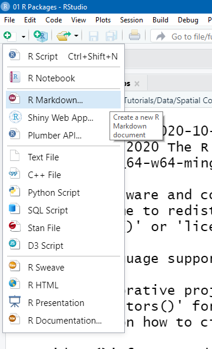
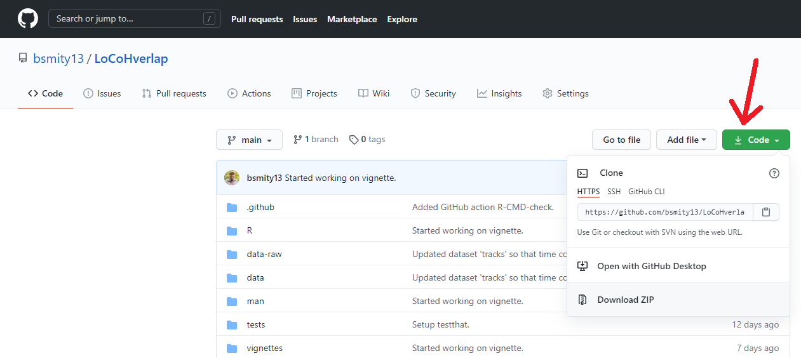
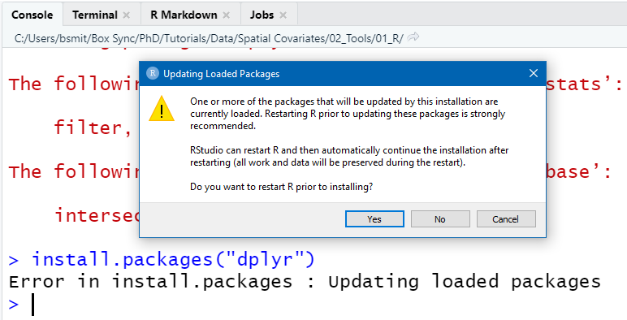
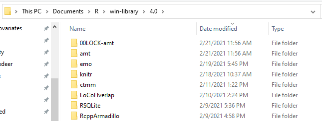

```{r setup, include=FALSE}
knitr::opts_chunk$set(echo = TRUE)

colorize <- function(x, color = "red") {
  if (knitr::is_latex_output()) {
    sprintf("\\textcolor{%s}{%s}", color, x)
  } else if (knitr::is_html_output()) {
    sprintf("<span style='color: %s;'>%s</span>", color, 
      x)
  } else x
}
```

Most of us use `R` on a regular basis for our analyses, but there's a chance that there are more things that `R` can do for you that you may not be aware of. This short section is on a few features of `R` that you might not already be familiar with, but which we will be using throughout the workshop.

## R Markdown

This is an R Markdown document. Markdown is a simple formatting syntax for authoring HTML, PDF, and MS Word documents. For more details on using R Markdown see <http://rmarkdown.rstudio.com>.

This workshop has an R Markdown HTML file for each module. You can also find the source code (*i.e.*, the `*.Rmd` file) used to create the HTML doc in each module's folder. You may find it useful to view the source code and see exactly how each document was written.

If you want to learn to use R Markdown on your own, it's easy to get started! RStudio's default template will set you up with everything you need to get started. From RStudio, click the "New File" button in the top left of your screen and select "R Markdown".

```{r new_rmd, echo = FALSE, out.width = "40%"}

```

## R Packages

We're all familiar with R packages, but do we *really* know how they work? Understanding the basic underpinnings will help us install packages from **source** and troubleshoot any issues. Let's dive into some details and see what we can learn.  

### What is an R package, anyway?

> The fundamental unit of shareable code
>
> `r tufte::quote_footer("Wickham and Bryan, [*R Packages*](https://r-pkgs.org/)")`

> Extensions to the R statistical programming language. [They] contain code, data, and documentation in a standardised collection format.
>
> `r tufte::quote_footer("[Wikipedia](https://en.wikipedia.org/wiki/R_package)")`

> Packages provide a mechanism for loading optional code, data and documentation as needed. The R distribution itself includes about 30 packages.
>
> A package is a directory of files which extend R.
>
> `r tufte::quote_footer("R Core Team, [*Writing R Extensions*](https://cran.r-project.org/doc/manuals/r-release/R-exts.html)")`


> A package is **not** a *library*.
>
> `r tufte::quote_footer("R Core Team, [*Writing R Extensions*](https://cran.r-project.org/doc/manuals/r-release/R-exts.html)")`

While the primary purpose of packages is to write code for others to use, there are some compelling other uses.

  * Hilary Parker on Personal R Packages

  > Wouldn’t it be great if incoming graduate students in Biostatistics/Statistics were taught to create a personal repository of functions like this?
  >
  > `r tufte::quote_footer("Hilary Parker, \"Not So Standard Deviations\"")` 
  > [Personal R Packages](https://hilaryparker.com/2013/04/03/personal-r-packages/)
  
  > I really should just make an R package with these functions so I don’t have to keep copy/pasting them like a goddamn luddite.
  >
  >`r tufte::quote_footer("Hilary Parker, \"Not So Standard Deviations\"")`
  > [Writing an R package from scratch](https://hilaryparker.com/2014/04/29/writing-an-r-package-from-scratch/)

  * R Packages as Research Compendia
  
  > As computer-based research has increased in complexity, so have the challenges of ensuring that this research is reproducible. To address this challenge, we review the concept of the research compendium as a solution for providing a standard and easily recognizable way for organizing the digital materials of a research project to enable other researchers to inspect, reproduce, and extend the research.
  >
  > `r tufte::quote_footer("Marwick et al. 2018 *The American Statistician*")`
  > DOI: [10.1080/00031305.2017.1375986](https://www.tandfonline.com/doi/full/10.1080/00031305.2017.1375986)

### Source vs. Binary

R packages are written in `R` (and sometimes other languages, like C++). They have some other specific requirements, but the functions (and sometimes the [documentation](https://cran.r-project.org/web/packages/roxygen2/vignettes/roxygen2.html)) are actually written in a series of (mostly) R scripts. This original code, written in `R`, is the **source**. In general, **source** code is human-readable.

Before a source package can be used normally in `R`, it must be **installed**. A source package can be installed by the R utility `R CMD INSTALL`, which you can read about in R with `?INSTALL`. 

On macOS and Windows, installed packages are stored as **binaries**, meaning they have been translated from text into a binary format that is specific to the operating system. *I.e.*, you can't run a package built on macOS on a Windows machine. In general, **binary** code is *not* human-readable.

By default, macOS and Windows do not have the system utilities needed to build a binary. We will come back to this in the next section (**Building Packages from Source**). Instead, most users will download pre-built binaries from [CRAN](https://cran.r-project.org/).

Authors of R packages submit their work to CRAN, which (after approval) takes the source code and creates a build (i.e., a **binary**) for many different versions of `R` and for many different [operating systems](https://cran.r-project.org/bin/) (Windows, macOS(x), and Linux). When you run `install.packages()`, you are by default connecting to CRAN, downloading the appropriate **binary** for your machine, and unzipping it into your default *library directory*. That is, CRAN built the **binary** for you so that you don't need the extra build tools.

### Building Packages from Source

*Okay, but what if I want to build my own package locally?*

You can do that! But if you're not on a Linux machine, you're going to need some help.

  * Windows users:  
      - You need `Rtools`. *It is __not__ an R package.* It is a stand-alone collection of tools and libraries that can be used to build packages (or even R itself) from source code. You can find the download and install instructions [here](https://cran.r-project.org/bin/windows/Rtools/).
    
  * macOS users:
    - You need the `Xcode` command line tools (which, apparently, requires you to register as an Apple developer). You can get it from the Mac App Store (*I think*. I am not a Mac user!).
    
*But I don't write R packages. Why would I need to know this?*  

First, maybe you want to learn to write your own package! But also, many programmers share their **source** code rather than a built **binary**. You can download their source code, but you need to build it yourself! One very popular example of this is when a developer posts an R package to a GitHub repository.

### Installing Packages from GitHub

If you want to install someone's package from the source code on GitHub, there are multiple ways to go about it. For example, you could:  

  1. Navigate to their GitHub repository ("repo") online. For example, you can see one of mine at https://github.com/bsmity13/LoCoHverlap. From the web browser, you can click **`r colorize("Code", "green")`**, download a ZIP file, unzip it, and use `R CMD INSTALL` to install it yourself.
  
```{r git_zip, out.width = "100%", echo = FALSE}
  


```

  2. Use an R package to help you! The package `devtools` is maintained by RStudio to help package developers with their workflow. One useful function is `devtools::install_github()`. You point the function to the GitHub repo, and it takes care of the rest (*i.e.*, all the other arguments have sensible defaults). For example, if you wanted to install my package in the example above:
  
```{r install_locohverlap, eval = FALSE}
devtools::install_packages("bsmity13/LoCoHverlap")
```

  (Of course, make sure you have the `devtools` package already installed!)
  
That function will download my repo, unzip it, and call `R CMD INSTALL` to build it locally. It will also print the output of `R CMD INSTALL` to your R console so you can see what's going on (and any error messages if it fails).

### Troubleshooting Installs

Sometimes, `R CMD INSTALL` will fail. In *most* cases, that is because you already have a package loaded in an R session. (*Some packages have external dependencies that could cause an install to fail, but that is rare*). This is analogous to trying to delete a folder if you have a file in it already open, because, by default, you have a single R *library directory* on your machine. That means all your R packages are installed to one place and loaded from one place. The process of updating a package is literally deleting the existing folder and re-installing, and you can't delete the existing folder if the files it contains are in use. That means if you have two or more R sessions open, packages loaded in *any* of them can cause an install to fail.

In general, it's a good idea to install/update packages from a clean R session with no other R sessions open on your machine.

One tricky situation when installing from GitHub is when a dependency of `devtools` needs to be updated. You might try `devtools::install_github()` from a clean, fresh session, but using that function will attach the `devtools` `NAMESPACE.` When your R session goes to update the `devtools` dependency, it will tell you:

```{r update loaded error, echo = FALSE, out.width = "100%"}

```

You should say `Yes` to this message, but when you do, you'll have to attach `devtools` again, and you'll find yourself stuck in an infinite loop.

The solution here is to update the packages it's asking for (`devtools` or one or more of its dependencies) manually from a fresh session. You should be able to do that with base R's `install.packages()`, avoiding any issues with attached `NAMESPACE`s.

The install process also "locks" the *library directory* by creating a folder in it called `00LOCK`. This prevents multiple installs from happening at the same time and creates a back-up of the original to restore in case of an error (which usually works -- but not always). You can read more details about this in the **Locking** section of `?install.packages()`.

```{r lock, echo = FALSE, out.width = "100%"}

```

Sometimes, when the install fails, the `00LOCK` directory gets left behind, stopping your future attempts to install that package. In my experience, the only way to fix this is to navigate to your *library directory* and delete the lock folder(s) manually. You can see exactly where your *library directory* is from R with this function:

```{r libpath}
.libPaths()
```

Navigate to that folder (on macOS it is inside a hidden folder) and delete the `00LOCK` directory, start a fresh R session, and try again to install your package.

## Interfacing with the Operating System

Once you find yourself outside of R's wheelhouse, you can reach out from R to other software. One of the easiest ways to do that is via the system **shell**.

> A shell is a computer program which exposes an operating system's services to a human user or other program.
>
> `r tufte::quote_footer("[Wikipedia](https://en.wikipedia.org/wiki/Shell_(computing))")`

The GUI ("gooey"; Graphical User Interface) that you interact with everyday when you start your computer is technically a shell, but most people (that I know) are referring to a CLI (Command Line Interface) when they say **shell**. You are probably aware of various CLIs, even if you don't use them much.  

  * Windows
    - cmd.exe
    - Windows PowerShell
    
  * macOS
    - Terminal.app
    
  * Linux
    - bash shell
    
Note that, for example, `bash` is a language that can be run by a CLI program. Both Windows and Mac have programs that can run `bash`, but `bash` is not the default command language in either operating system. (Mac moved from `bash` to `zsh` as the default Terminal language in 2019).

This is not a comprehensive lesson on using a CLI, but we will be writing some shell code today. We'll do a tiny bit of surface scratching in the next module. For now, suffice it to say that we can pass shell commands to the system from R with the R function `shell()` on Windows or `system()` on Mac. For example, in Windows, the command `dir` prints the directory contents. Here's what I get if I run this from R.

```{r shell dir, eval = FALSE}
shell("dir")
```
```
 Volume in drive C is Windows
 Volume Serial Number is 6EF3-113E

 Directory of C:\Users\bsmit\Box Sync\PhD\Data\Tutorials\Spatial Covariates\02_Tools\01_R

02/18/2021  06:01 PM    <DIR>          .
02/18/2021  06:01 PM    <DIR>          ..
02/18/2021  04:58 PM                68 .Rhistory
02/18/2021  05:08 PM               218 01 R.Rproj
02/18/2021  06:01 PM         1,031,109 r.html
02/18/2021  06:01 PM             9,632 r.Rmd
               4 File(s)      1,041,027 bytes
               2 Dir(s)  426,831,962,112 bytes free
```

If you're on Mac, try this:

```{r mac system, eval = FALSE}
system("ls")
```

I think (*hope?* `r emo::ji("grimacing face")`) your results will be similar.

R has good built-in functions for doing things like printing out directory contents (see `?dir`), so we won't be relying on the shell for that. Instead, we'll be relying on the shell to call other programs or open other files on our computers. We'll see this in the next module.

The last thing we'll talk about here is letting the operating system decide how to handle a file. Your system has defaults for what program to use when it encounters a particular file type. If you call a file with the shell, the system will look-up the default program and then use it to open that file. On Windows, you will need to use the R function `shell.exec()` to make sure the OS looks up the file extension. On Mac (or Linux), `system()` should still do the trick.

Let's see two examples: (1) a webpage and (2) an image.

  1. Anytime your OS sees a file path starting with `"https://"`, it will know to use your web browser to open it.  

  - On Windows: `shell.exec("https://www.github.com")`
  - On Mac: `system("https://www.github.com")`
    
  2. As opposed to `"https://"`, paths to files will start with `"file:///"` (yes, three slashes). This is not necessary if you're using a relative path to call a file (in an up-to-date version of R). In this R Markdown's current directory, there is an image called `"happy.png"`. Let's open it.  
  
  - On Windows: `shell.exec("happy.png")`
  - On Mac: `system("happy.png")`
    
You should hopefully see this smiling face!

```{r happy, echo = FALSE}
knitr::include_graphics("happy.png")
```

## Conclusion

R can do a lot more than you might think. It can produce dynamic documents (HTML, PDF, or MS Word) that contain text, images, and code chunks with R Markdown. R packages extend the base functionality of R signficantly. These packages themselves are written primarily in R, and this series of R scripts is the package source code. To be used in an R session, a package needs to be installed, or converted from source to binary and copied to a library directory. Sometimes that can result in errors, and you'll need to do some troubleshooting to fix them. When you've hit the limits of R, you can call out to the operating system for help.

---

<a href = "../../index.html" class = "workshop-home">Workshop Table of Contents</a>