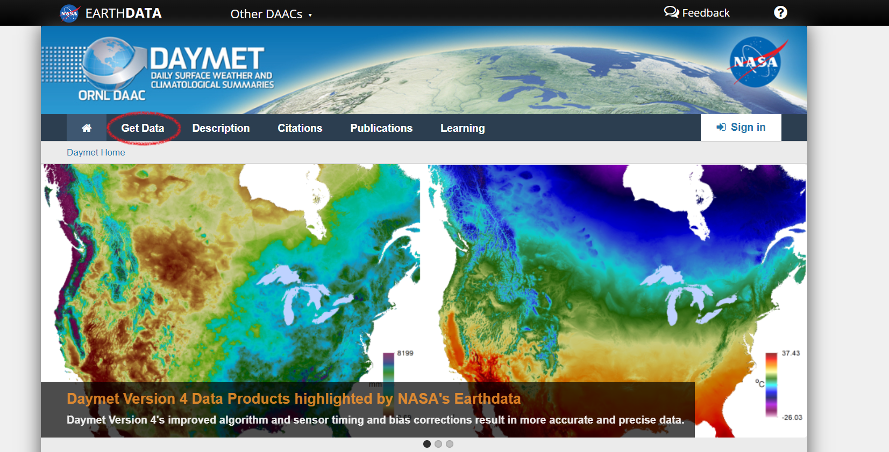

```{r setup, include = FALSE}
# Data sources
ERA5 <- data.frame(Dataset = "ERA5-Land Hourly",
                   Source = "ECMWF",
                   Link = "<a href = 'https://cds.climate.copernicus.eu/cdsapp#!/dataset/10.24381/cds.e2161bac?tab=overview' target='_blank' rel='noopener noreferrer'>ERA5-Land</a>",
                   Citation = "DOI: <a href = 'https://doi.org/10.24381/cds.e2161bac' target='_blank' rel='noopener noreferrer'>10.24381/cds.e2161bac</a>")
SNODAS <- data.frame(Dataset = "SNODAS",
                     Source = "NOAA",
                     Link = "<a href = 'https://nsidc.org/data/g02158' target='_blank' rel='noopener noreferrer'>NSIDC</a>",
                     Citation = "DOI: <a href = 'https://doi.org/10.7265/N5TB14TC' target='_blank' rel='noopener noreferrer'>10.7265/N5TB14TC</a>")
Daymet <- data.frame(Dataset = "Daymet v4",
                     Source = "NASA",
                     Link = "<a href = 'https://daac.ornl.gov/DAYMET/guides/Daymet_Daily_V4.html' target='_blank' rel='noopener noreferrer'>ORNL DAAC</a>",
                     Citation = "<a href = 'https://daymet.ornl.gov/files/Thornton_Daymet_V4_submitted_2021-01-20.pdf' target='_blank' rel='noopener noreferrer'>Thornton et al. 2020</a>")
# Combine
data_sources <- rbind(ERA5, SNODAS, Daymet)
# Sort
data_sources <- data_sources[order(data_sources$Dataset), ]

```

## General Approach

Since this is our first module on downloading data, I'm going to try to emphasize the general approach to downloading from a remote data source. I'll break it down into 4 steps:

1. **Find the data.** Maybe you read about a data source in a paper or heard about it from a colleague. A Google search will take you to the right website, but now what? *Most* data sources you encounter will have an obvious "Download Data" link or button right on the home page. Most of those will take you to a graphical web interface that would require lots of pointing and clicking. But we know now that can be slow, tedious, and not very reproducible. What you want to do is find, somewhere on the site, information about "batch" downloads. On some websites it'll be very easy, and for others it'll be buried deep. But it's there (I haven't found a counterexample, yet!).
2. **Figure out the pattern.** All large, public data sources are organized by professionals. They will have rules about directory structure and filenames that makes it easy to find the data you need. But that structure will vary from source to source, so you'll probably have to figure out the organizational conventions the first time you see a dataset. You'll also have to figure out what protocols the organization wants you to use to download data. Some will use plain old HTTP or HTTPS, but others will specifically want to use a File Transfer Protocol (FTP) or others.
3. **Construct the URL.** Once you've figured out where the files are stored, how they're organized, and the protocols to download them, you can use those patterns to create the URL that will point your downloader to the data. Over HTTPS, your URL might be something like `https://greatdata.gov/bestdata/2021/raster.tif`, and over FTP it'll be something like `ftp://greatdata.gov/bestdata/2021/raster.tif`. You can probably separate that into a base URL (`https://greatdata.gov/bestdata/`), plus some parameters like year (`2021/`) and filename (`raster.tif`). Combine them all with R's `paste0()` function, and you're ready to go!
4. **Download the data.** Once you have the URL, pass it to your favorite downloader. R has a built-in function, `download.file()` that you can use. You can also pass the text from R to the system shell and use a system downloader (*e.g.*, `curl`, `wget`).

In this module, I'll emphasize these 4 steps for each of our SWE data sources, but in the following modules, we will jump straight into the downloading.

## What is SWE?

> Snow Water Equivalent (SWE) is a common snowpack measurement. It is the amount of water contained within the snowpack. It can be thought of as the depth of water that would theoretically result if you melted the entire snowpack instantaneously.  
>
> `r tufte::quote_footer("[USDA NRCS](https://www.nrcs.usda.gov/wps/portal/nrcs/detail/or/snow/?cid=nrcs142p2_046155)")`

In other words, SWE accounts for how fluffy or dense the snow is. That tends to make it a better measurement for understanding animal movements than snow depth alone. However, note that many of the data sources we cover here also have snow depth data, so you should be able to get snow depth if you prefer.

For a detailed discussion of how snowpack affects animal movement, you might be interested in Mahoney et al. (2018).

<span style = "font-size: 0.8em;">Mahoney, Peter J., et al. 2018. "Navigating snowscapes: scale‐dependent responses of mountain sheep to snowpack properties." Ecological Applications 28(7): 1715-1729. DOI: [10.1002/eap.1773](https://doi.org/10.1002/eap.1773).</span>

## Data Sources

There are multiple data sources that have broad spatial coverage of SWE data. We will discuss these three:  

`r knitr::kable(data_sources, row.names = FALSE, escape = TRUE)`

Each of these three data sources have their pros and cons. 

### Daymet

The Daymet data covers all of North America. It models surface weather at a 1 km resolution based on weather station data. Data are available from 1980 -- present. Unfortunately, the model's treatment of SWE is not ideal. From the Daymet user manual:

>Snowpack, quantified as snow water equivalent (SWE), is estimated as part of the
Daymet processing in order to reduce biases in shortwave radiation estimates related to
multiple reflections between the surface and atmosphere that are especially important
when the surface is covered by snow (Thornton et al. 2000). The Daymet (v3.0) dataset
includes estimated SWE as an output variable since this quantity may be of interest for
research applications in addition to its primary intended use as a component of the
Daymet shortwave radiation algorithm. An important caveat in the use of SWE from the
Daymet (v3.0) dataset is that the algorithm used to estimate SWE is executed with only a
single calendar year of primary surface weather inputs (daily maximum and minimum
temperature and daily total precipitation) available for the estimation of a corresponding
calendar year of snowpack. Since northern hemisphere snowpack accumulation is
commonly underway already at the beginning of the calendar year, the SWE algorithm
uses data from a single calendar year to make a two-year sequence of temperature and
precipitation, then predicts the evolution of snowpack over this two-year period to
provide an estimate of yearday 365 (December 31 for non-leapyears) snowpack as an
initial condition for the January 1 time step of the actual calendar year. The problem with
this approach is that it ignores the dependence of January 1 snowpack on preceding
calendar year temperature and precipitation conditions, and so generates potential biases
in mid-season snowpack which can propagate to biases in late-season timing of snow
melt. 
>
> `r tufte::quote_footer("[Daymet V3](https://daymet.ornl.gov/static/files/UserGuides/v3/DaymetV3_readme_tileselectiondata.pdf)")`

What I take away from this warning is that the SWE is calculated to adjust for the other meterological variables, but that the calculation itself is sub-optimal (because it ignores the dependence of January 1 on the preceding year's temperature and precipitation). I've also seen instances in the ecological literature where someone used Daymet for temperature and precipitation but *not* for SWE. Ultimately, you should make your own judgement call, but note that Daymet is available at a finer scale than ERA5 and for a longer timeseries than SNODAS, so it may be the best choice for you.

### ERA5-Land Hourly

The ERA5-Land Hourly dataset is meant to be a global, historical climate reconstruction. It predicts SWE (among other variables) at hourly intervals across the globe. It's native resolution is coarse at ~9 km (technically 1° x 1° cells), so it's very well suited to very large-scale analyses. Data are currently available from 1981 -- present, but they will soon provide data from 1950 -- present.

### SNODAS

> SNODAS is a modeling and data assimilation system developed by NOHRSC to provide the best
possible estimates of snow cover and associated parameters to support hydrologic modeling and
analysis. The aim of SNODAS is to provide a physically consistent framework to integrate snow
data from satellite, airborne platforms, and ground stations with model estimates of snow cover.
>
> `r tufte::quote_footer("[SNODAS User Guide](https://nsidc.org/data/g02158)")`

Okay, so SNODAS is fancy `r emo::ji("tuxedo")` `r emo::ji("cocktail_glass")`. It was developed by NOAA's National Snow and Ice Data Center, so it seems apparent that it should do a good job of estimating snow and ice cover. It is available for the contiguous US at a 1 km resolution. Data are available from 2004 -- present.

I have seen SNODAS used in many ecology publications, and in my opinion, it is the highest quality of these three datasets. However, it also covers the shortest time window and has the most limited geographic coverage.

## Downloading Data (the hard way)

We'll start by looking at how to download data the hard way. I want to go through the process here because it gives a good overview of the diversity of formats and tools by which geospatial data are made available. If you can master these skills, you can find a way to download almost any geospatial data from R. In the next section, we will cover downloading these data using an R package that I am writing, `snowdl`.

### Daymet

#### Step 1: Find the data

The obvious place to start is on the [Daymet website]("https://daymet.ornl.gov/"). From there, it's fairly easy to find the link to "Get Data".

```{r daymet home, echo = FALSE, out.width = "100%"}

```

From there, you can find the section "Direct Download", with a link that will take you to [Daymet THREDDS Data Server](https://thredds.daac.ornl.gov/thredds/catalogs/ornldaac/Regional_and_Global_Data/DAYMET_COLLECTIONS/DAYMET_COLLECTIONS.html). This webpage shows the directories available to you, and you can pick one of your choice. We want the daily tile data, so we'll click [Daymet: Daily Surface Weather Data on a 1-km Grid for North America, Version 4 (tiles)](https://thredds.daac.ornl.gov/thredds/catalog/ornldaac/1840/tiles/catalog.html). In this directory, we can see the data are organized by year. Inside a year directory, the data are organized by tile. And in each tile's folder, you can find various NetCDF (`*.nc`) rasters, including `swe.nc`. Click on `swe.nc`, and it takes you to a page that describes how to download it.

#### Step 2. Figure out the pattern

Okay, we've found our data. Let's take a look at where we found it and see if we can figure out the pattern. A good rule of thumb if you aren't very experienced with remote data is to look for an HTTP or HTTPS server. We can see that the THREDDS Data Server does provide us a link via an HTTP server. Here is an example:

`https://thredds.daac.ornl.gov/thredds/fileServer/ornldaac/1840/tiles/2019/10090_2019/swe.nc`

We can figure out (from our browsing in Step 1) that the base URL, *i.e.*, the part of the link that all the files share in common, is everything up until the year:

`https://thredds.daac.ornl.gov/thredds/fileServer/ornldaac/1840/tiles/`

The next directory in the path is just simply the year. In this case, `2019/`.

The next directory is `<tile>_<year>`, so in this case (tile 10090 and year 2019), `10090_2019`.

You can figure out what tiles you need for your study area at the [Daymet Tile Selection Tool](https://daymet.ornl.gov/gridded/).

Now we're in the directory with our rasters, and we want to pick `swe.nc` in all cases. (Of course, if you want more data from Daymet, feel free to change which file you download).

#### Step 3. Construct the URL(s)

With all of this information, we can construct the URL(s) to the file(s) we need.

So say we want SWE data for Logan, UT for 2018. The tile we need is 11735. Here's some R code to create our URL:

```{r daymet url}
# Year and Tile
year <- 2018
tile <- 11735

# Base URL
base <- "https://thredds.daac.ornl.gov/thredds/fileServer/ornldaac/1840/tiles/"

daymet_swe_url <- paste0(base,
                         year, "/",
                         tile, "_", year, "/",
                         "swe.nc") 

print(daymet_swe_url)
```

What if we want all the data from Logan from 1990 -- 2019? We can pass a vector of years to paste and get all of our URLs at once.

```{r daymet urls}
# Year and Tile
year <- 1990:2019
tile <- 11735

# Base URL
base <- "https://thredds.daac.ornl.gov/thredds/fileServer/ornldaac/1840/tiles/"

daymet_swe_urls <- paste0(base,
                          year, "/",
                          tile, "_", year, "/",
                          "swe.nc") 

print(daymet_swe_urls)
```

#### Step 4. Download the file(s)

Now that we've got our URLs, we're ready to download the files. We'll use R's `download.file()` here.

First, check the help file to understand how the function works.

`?download.file` [link](https://www.rdocumentation.org/packages/utils/versions/3.6.2/topics/download.file)

We can see that we need to pass it the URL as a character string, the destination file (what you want to save it as) as a character string, and possibly some other optional arguments. One of those arguments is important for us now. The argument `mode` tells it what kind of file to download. Since this file stores binary data, we need to tell it that with `mode = "wb"`. This is generally true of raster data. Let's download our 2018 file for Logan.

```{r download daymet, eval = FALSE}
download.file(url = daymet_swe_url,
              destfile = "Logan_2018.nc",
              mode = "wb")
```

We can load it and plot it using the `raster` package to make sure it worked. The file has 365 bands, each representing a day of the year. We can tell `raster` to load `band = 1` to get January 1st.

```{r load daymet}
library(raster)
daymet_rast <- raster("Logan_2018.nc", band = 1) 
plot(daymet_rast)
```

Choose your favorite method for iterating over many files. You could write a `for()` loop or perhaps use `mapply()` to download any number of tiles/years you need. In a later section, we'll see some R functions I wrote to make this easy for you.

### ERA5-Land Hourly

Turns out, there is an R package for downloading data from the European Centre for Medium-range Weather Forecasting (ecmwf) called `ecmwfr`. The [vignette](https://cran.r-project.org/web/packages/ecmwfr/vignettes/cds_vignette.html) for the package gives a good overview of how the process works.

**You first need to register with ECMWF for a free account to be able to download the data through the [API](https://en.wikipedia.org/wiki/API).**

The need for us to follow the general steps goes out the window when an organization builds a dedicated API. We no longer need to figure out a URL, but rather, we need to figure out how to construct a "request" that the API can understand. All of this is detailed, including an animated GIF, in the `ecmwfr` vignette.

Later, we'll see the wrapper functions that I wrote to make this even simpler for getting SWE data, but if you want other data from ERA5 (or any other climate data from the ECMWF), check out the vignette.

### SNODAS

#### Step 1. Find the data.

Let's begin at the [SNODAS home page](https://nsidc.org/data/g02158). We can see there is a tab called "Download Data". Click on it.

You'll immediately notice that there is information about an FTP site. Jackpot! `r emo::ji("money-mouth face")`

> FTP data can be downloaded through a Web browser (Firefox or Edge are recommended) or command line via FTP. For help downloading data through an FTP client, go to the How to access data using an FTP client support page.
>
> `r tufte::quote_footer("[SNODAS -- Download Data](https://nsidc.org/data/g02158)")`

Click the link that says [How to access data using an FTP client](https://nsidc.org/support/64231694-FTP-Client-Data-Access).

There is information here about how to use a command line FTP. We're *not* going to do this, but this tells us how to construct our URLs.

#### Step 2. Figure out the pattern.

The command line instructions give as a good idea what the base URL will be. First off, it's an FTP site, so it will start with `ftp://`. The node to connect to is `sidas.colorado.edu`, so to make that a full URL, add the protocol to the front: `ftp://sidas.colorado.edu`.

Don't worry about the login part, because we're not browsing.

Then it tells you to use the `cd` command. We know what that does! It changes directory. So `cd /pub/DATSETS/NOAA/XXXX` would make our new URL `ftp://sidas.colorado.edu/pub/DATSETS/NOAA/XXXX`.

At this point it is probably still unclear what exactly you should put for `XXXX`. So you can actually follow the directions on their page to login via FTP from your shell and explore. If you were to do that, you'd find the URL of a file you want and be able to generalize the pattern. Here's an example I found exactly that way.

`ftp://sidads.colorado.edu/DATASETS/NOAA/G02158/masked/2019/01_Jan/SNODAS_20190101.tar`

Note that a `*.tar` file is a "tarball", which is just a compressed directory (like a ZIP file on Windows). R can decompress tarballs with `untar()`.

#### Step 3. Construct the URL.

Okay, now that we've found a file, let's construct the URL. We can see that after the base URL, we need to navigate into folders that use parts of the date to make the folder names. R has functions to handle dates fairly easily, so let's try to build a URL from an actual `Date` object.

Let's say we want data for February 22, 2020.

```{r snodas url}
# Date
date <- as.Date("2020-02-22")

# Base URL
base_url <- "ftp://sidads.colorado.edu/DATASETS/NOAA/G02158/masked/"

# Grab date components
y <- format(date, "%Y")
m <- format(date, "%m") 
mon <- format(date, "%b") #Gets the abbreviated month, e.g. "Feb"
d <- format(date, "%d")

# Filename
fn <- paste0("SNODAS_", y, m, d, ".tar")

# Construct URL
snodas_url <- paste0(base_url, y, "/", m, "_", mon, "/", fn)

print(snodas_url)
```

#### Step 4. Download the data.

Now that we've got our URL, we can pass it to `download.file()`, just like before. Remember to set `mode = "wb"`.

```{r download snodas, eval = FALSE}
download.file(url = snodas_url, 
              destfile = "SNODAS_file.tar",
              mode = "wb")
```
Since SNODAS gives us access to tarballs, we still need to decompress the tarball to get to our data. AND THEN, turns out the files inside are also compressed with gzip (`*.gz`), so they need to be extracted, as well.

Linux and macOS users should be able to extract these files easily with built-in tools. Windows users need another utility. I highly recommend [7-Zip](https://www.7-zip.org/) if you are on Windows and you need to unpack any sort of compressed file.

Turns out, R can also unpack these files, but I'm going to skip the details for now. I have written functions in `snowdl` that will handle this for you, which we'll look at in just a few minutes.

## Downloading Data (the easy way)

Now that we've seen the process, we can see what all of this looks like wrapped up in some nice R functions to do it for you. I wrote `snowdl` to make my own life easier when I was comparing SWE data sources, but I'm hoping that you also find that it makes your life easier.

### Installing `snowdl`

As long as you have all the software required for this workshop, you should have no problem installing `snowdl` from GitHub. You can download and install it from R with this command:

```{r install snowdl, eval = FALSE}
devtools::install_github("bsmity13/snowdl")
```

Once it's installed, attach it to your R session the usual way:

```{r attach snowdl}
library(snowdl)
```

This package is still a work in progress, so it could change significantly in the coming months. I have some already-planned changes that are laid out on GitHub, but who knows what I'll decide as I go. When you need this for your own work, make sure to check the GitHub repo to see if there are any updates.

https://github.com/bsmity13/snowdl

One day soon there will be nice wrapper functions that do all the steps for you in one line of code, but for now, I'm planning to keep this step-by-step workflow intact.

### Daymet

Daymet data is quite easy to get, since it doesn't require logging into and API or extracting compressed files. To do it, use the function `get_daymet_swe()`. Check out the help file with `?get_daymet_swe`.

Here's an example that downloads 5 years of data for 2 different tiles to a folder called "test". Note the output directory here is a relative path, so it will create a folder called "test" inside your current working directory.

```{r snowdl daymet, eval = FALSE}
get_daymet_swe(year = 2015:2019,
               tile = c(12095, 12096),
               out_dir = "test")
```

### ERA5-Land Hourly

The ERA5 data is a little trickier because it requires you to login via the API and create a "request". Remember, see the [`ecwmfr` vignette](https://cran.r-project.org/web/packages/ecmwfr/vignettes/cds_vignette.html) for details on how to do that. `snowdl` has wrapper functions to make things a little bit quicker.

The process requires 4 functions. (1) `e_key()` to register your user key, (2) `e_request` to build the request, and (3) `get_request()` to download the data.

This example (if it had a real API key) would download data for February 22 for the years from 2015 -- 2019. It also crops it to a specific bounding box.

```{r snowdl era5, eval = FALSE}
# Register key (this one is fake)
e_key(user = "test@mail.com", key = "123", service = "cds")
# Build request list
req <- e_request(variable = "snow_depth_water_equivalent",
                 years = 2015:2019,
                 months = 2,
                 days = 22,
                 area = c(46, -112, 44, -109),
                 out_file = "test.nc")
# Get data
ecmwf_path <- get_request(user = "74133",
                     request = req)
```

### SNODAS

The SNODAS workflow also requires 3 functions: (1) `download_SNODAS()` to download the tarballs, `unpack_SNODAS()` to extract the contents from the compressed files, and (3) `rasterize_SNODAS()` to load the rasters (possibly crop) and save in a format that is easy to load into R.

This example downloads data for February 22 of 2019 and 2020, then unpacks it all and rasterizes it.

```{r snowdl snodas, eval = FALSE}
# Download
download_SNODAS(as.Date("2020-02-22"),
                out_dir = "test")
download_SNODAS(as.Date("2019-02-22"),
                out_dir = "test")
# Unpack
unpack_SNODAS(tar_dir = "test") #unpacks all tarballs in directory
# Write to raster
rasterize_SNODAS(extent = extent(-111, -109, 44, 46))
```

## Conclusion

In this module, we covered three potential data sources for snow-water equivalent data. Each has pros and cons, and it is up to you to decide which is best for your application.

Hopefully, you have a better understanding of how to find the files you need on a webserver, how to download them with R, and how to decompress them and load them.

I also hope you find `snowdl` useful next time you need SWE data.

---

<a href = "../../index.html" class = "workshop-home">Workshop Table of Contents</a>